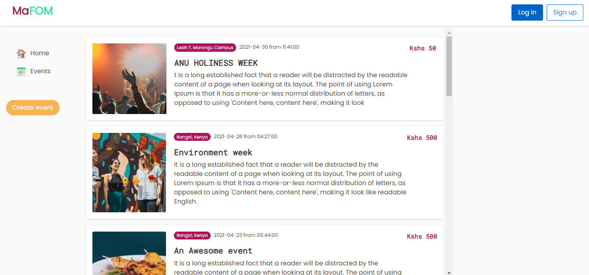
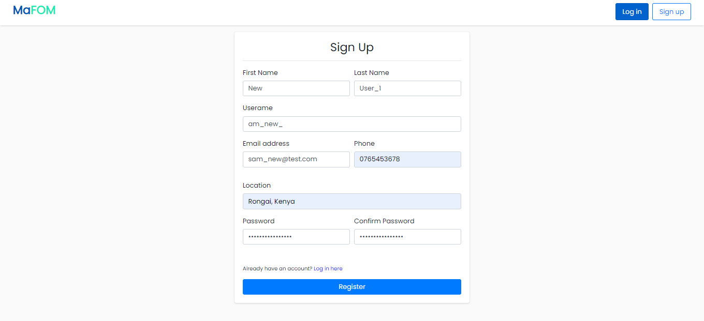
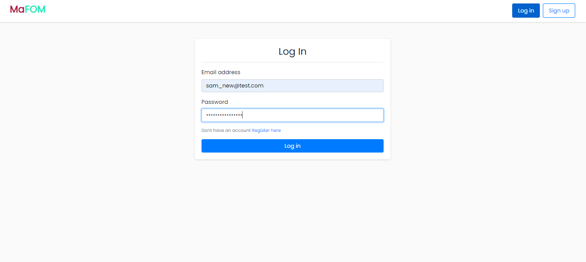
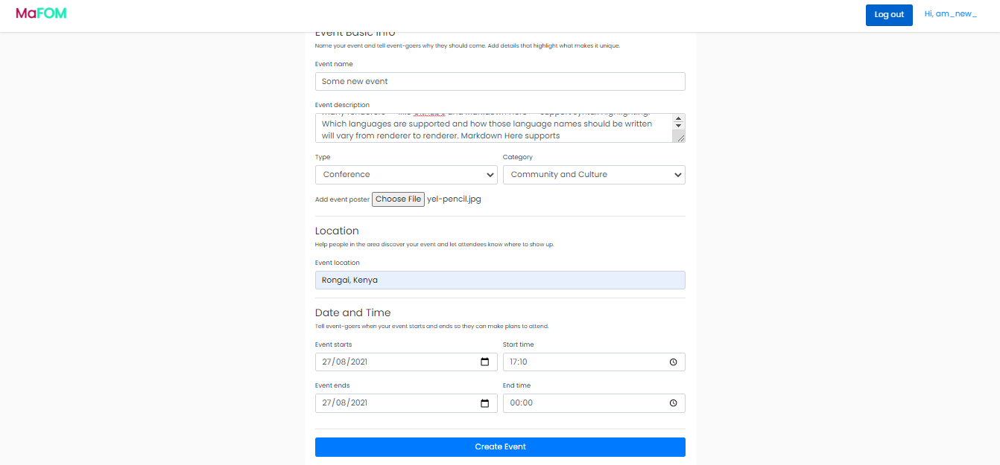
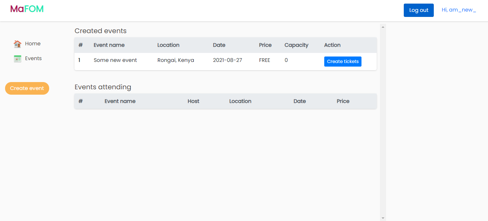
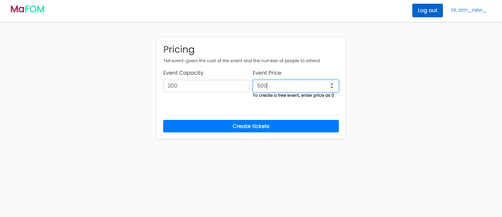
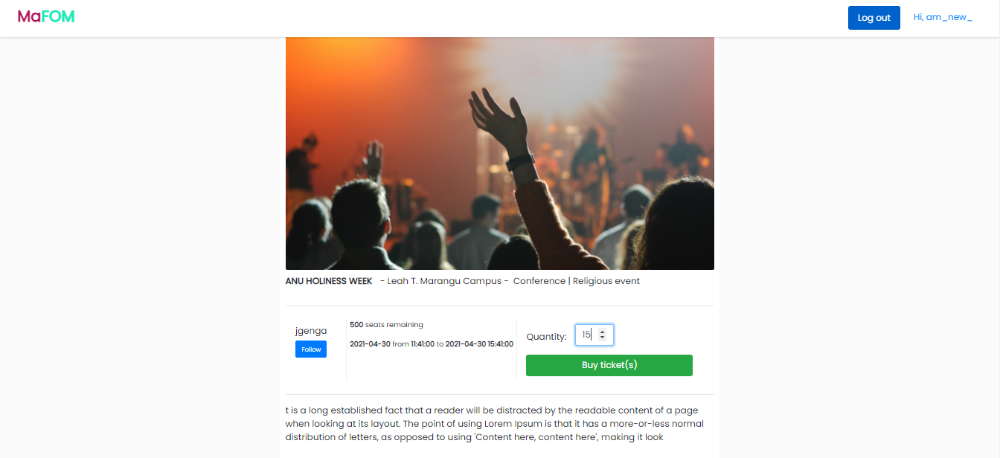
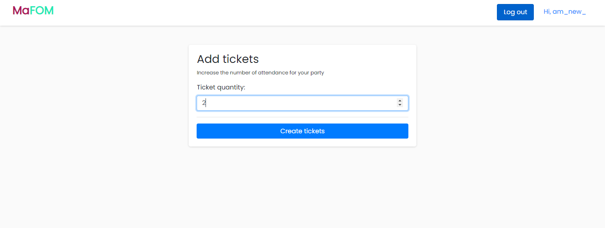

#  

MaFOM is a simple online Ticketing System for events.

It works by allowing users to register, login, view events, and buy tickets to the event.

A user can also create their own event for as little as nothing; 💯 free (A user can alternate roles between being an event attendee and a host)

The project was built in collab with my friend [Allan Abere](https://github.com/Allan70).

## Languages and Technologies 🛠

* HTML
* CSS
* JavaScript
* PHP
* MySQL

 

## Requirements

* [xampp](https://www.apachefriends.org/index.html) or [wamp server](https://sourceforge.net/projects/wampserver/) or [mamp](https://www.mamp.info/en/windows/)

>**NOTE**
>
> In this documentation we'll be using xampp

 

## Installation 💾

1. Clone the [project](https://github.com/JacobJax/MaFOM.git) to **htdocs** folder in xampp by running: 
`git clone https://github.com/JacobJax/MaFOM.git` to `C:\\xampp\htdocs`

1. Open xampp and start *Apache* and *MySQL*

1. On the browser, navigate to `http://localhost/phpmyadmin/` 

1. Click on *import* then *choose file*. Nacigate to `C:\\xampp\htdocs\MaFOM\` and select _**mafom_mgt.sql**_ 

1. Run the sql file to create the database and its entries

1. You can then open the project in the browser on `http://localhost/MaFOM/public/index.php`

 

## Register and Log in
The index page allows you to view a list of pets but will not let you adopt any without an account.

On the log in page, click on `Register here` and enter your details then click `Register` to create an account

You'll then be directed to the login page where you enter your log in details and click `Log in`

Logging in directs you to the homepage.

 

## Creating a new Event

An event is created with very few simple steps.

On the homepage click `Create Event`

Enter the event details and then click `Create Event` button.

 

## Creating Tickets 
Once you create an event, the event becomes disabled by default.

To activate your event you need to add tickets to it.

On the Events page; Which you'll be redirected to, Click `Create Tickets`

Enter the event capacity(The number of attendies you're expecting) and the price of the ticket.

> If you are hosting a free event, input the price as 0

Click on `Create Tickets`. This creates tickets for your event and activates your event.

 

## Buying tickets to an event

To buy a ticket to an event, navigate to the homepage and browse through the events.

Once you found one thats interesting, click on it.

On the Event details page, enter the *Quantity*(The number of tickets you want to buy).

Click on `Buy tickets`. This will redirect you to the Events page.

 

## Adding tickets

Incase your tickets get depleted because you're hosting an awesome event or you just feel the tickets woun't be enough and you'd want to leave no one out you can always add more tickets.

On the Events page, click `Add more tickets`

Enter the number of tickets you want to add then click `Create tickets`

 

### Future Improvements 🏗 

1. **M-Pesa daraja API intergration** - The project would go well with inclusion of payment service from example MPESA

1. **Include Refund system** - To allow users to get refunds incase they cancell of to refund users incase an event bails.

 

Alot of improvements are still underway but still feel free to **Clone** or **Fork** the project.
